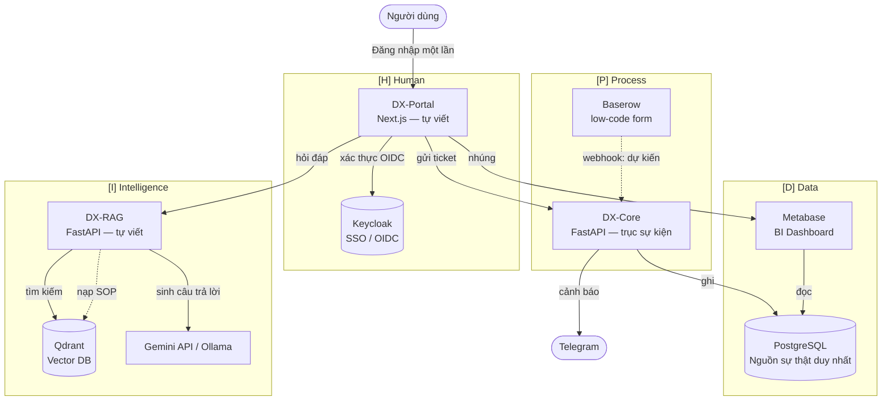
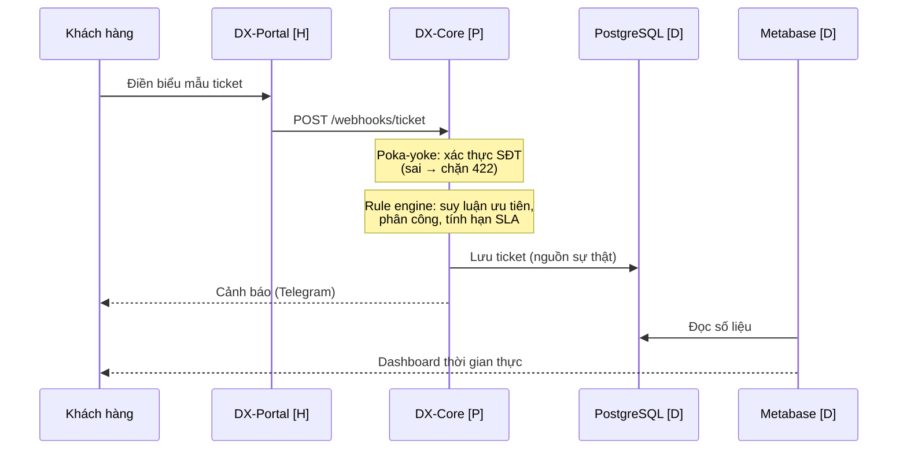
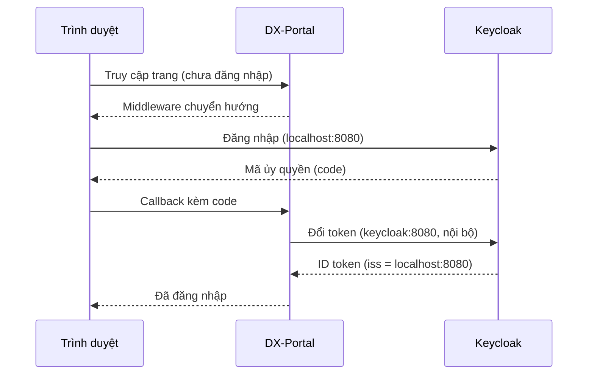
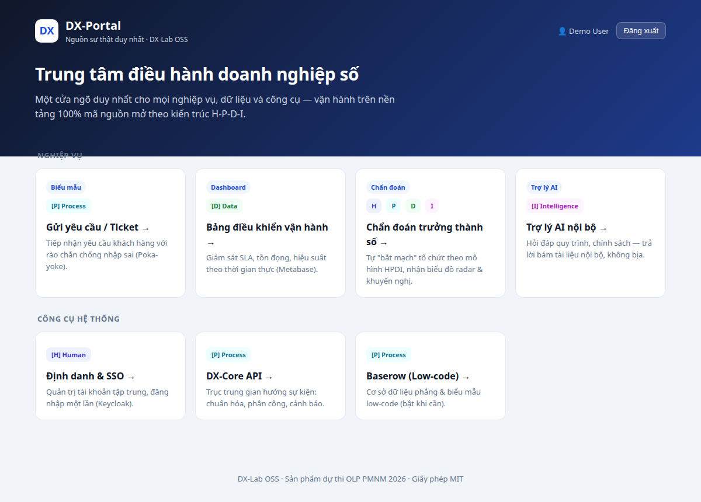
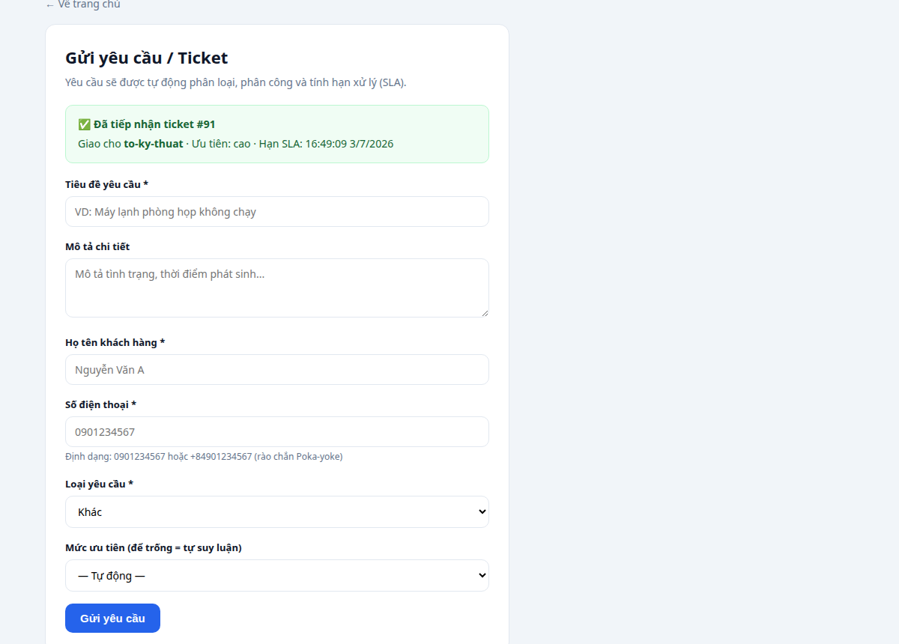
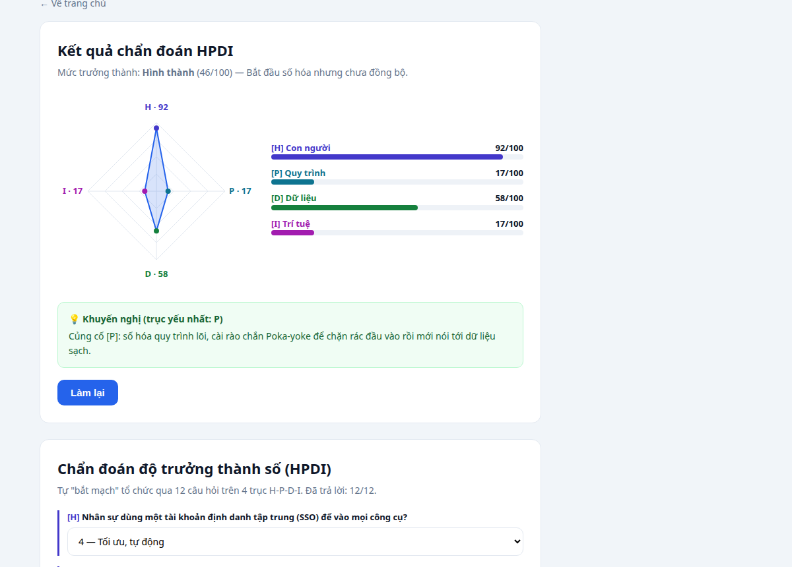
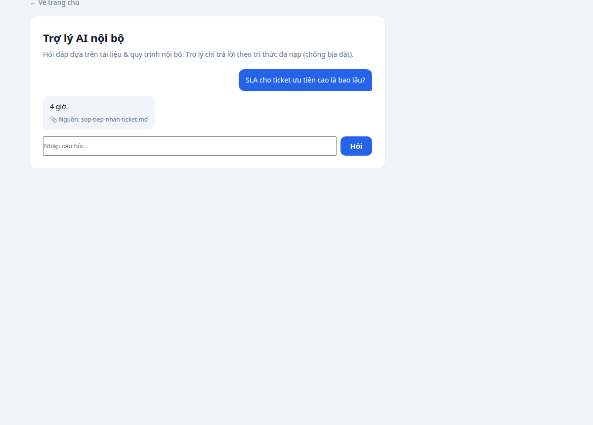
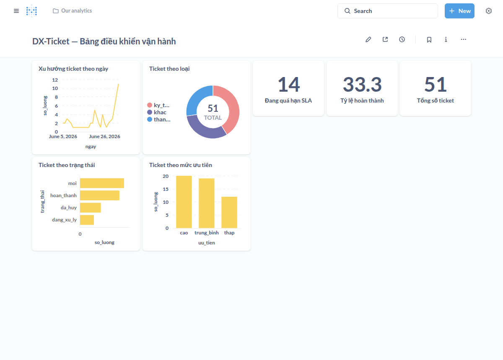

# Kiến trúc DX-Lab OSS

Tài liệu kiến trúc hệ thống — tái hiện đủ 4 không gian **H-P-D-I** của mô hình DX-OS
bằng ngăn xếp **100% mã nguồn mở**, triển khai một lệnh (`docker compose up`).

> Xem thêm: [Đề xuất dự án](du-an.md) · [Giáo trình DX-OS](dx-os/README.md)

---

## 1. Tổng quan

DX-Lab OSS là một *hệ điều hành doanh nghiệp số* thu nhỏ. Người dùng đăng nhập một lần (SSO)
vào **DX-Portal** — nguồn sự thật duy nhất — rồi thao tác trên 4 không gian chức năng:

| Không gian | Vai trò | Thành phần |
|-----------|---------|-----------|
| **[H] Human** | Định danh tập trung (SSO), cổng thông tin nội bộ | Keycloak · **DX-Portal** (tự viết) |
| **[P] Process** | Biểu mẫu, rào chắn Poka-yoke, phân công & SLA tự động | **DX-Core** (tự viết) · Baserow |
| **[D] Data** | Nguồn sự thật duy nhất, dashboard thời gian thực | PostgreSQL · Metabase |
| **[I] Intelligence** | Trợ lý AI bám tri thức nội bộ, chống ảo giác | **DX-RAG** (tự viết) · Qdrant · Gemini API/Ollama |

Thành phần đặc thù: **DX-Diag** — chẩn đoán độ trưởng thành HPDI (biểu đồ radar + khuyến nghị).

> **Lộ trình mở rộng (chưa triển khai):** Nextcloud (lưu trữ P.A.R.A), Rocket.Chat (giao tiếp),
> Node-RED (automation trực quan) — đã có trong thiết kế, sẽ bổ sung ở phiên bản sau.

---

## 2. Sơ đồ kiến trúc



**Nguyên lý tiến hóa tuyến tính:** quyền điều khiển chuyển dần từ con người [H] → quy trình [P]
→ dữ liệu [D] → trí tuệ [I]. Không thể nhảy lên [I] khi [P]/[D] chưa chuẩn hóa
("rác đầu vào — rác đầu ra").

---

## 3. Luồng nghiệp vụ DX-Ticket (end-to-end)

Kịch bản demo: tiếp nhận & xử lý yêu cầu khách hàng.



- **Poka-yoke:** SĐT sai định dạng bị chặn ngay đầu nguồn (HTTP 422) → chống rác đầu vào.
- **Rule engine:** ticket Kỹ thuật → Tổ Kỹ thuật, ưu tiên Cao, SLA 4h; Thanh toán → Kế toán;
  Khác → CSKH.
- Mọi ticket đổ về **một** nguồn sự thật (PostgreSQL) → không còn ốc đảo dữ liệu.

---

## 4. Luồng đăng nhập một lần (SSO)



> **Điểm kỹ thuật:** trình duyệt truy cập Keycloak qua `localhost:8080`, còn container DX-Portal
> đổi token qua `keycloak:8080` (mạng nội bộ). Giải quyết bằng `KC_HOSTNAME` cố định issuer +
> `KC_HOSTNAME_BACKCHANNEL_DYNAMIC` — một chỗ nhiều triển khai Keycloak+Docker hay vấp.

---

## 5. Thành phần & cổng dịch vụ

| Dịch vụ | Cổng | Công nghệ | Giấy phép | Tự viết |
|--------|------|-----------|-----------|:------:|
| DX-Portal | 3000 | Next.js 14 + next-auth | MIT | ✅ |
| DX-Core | 8000 | FastAPI (Python) | MIT | ✅ |
| DX-RAG | 8001 | FastAPI + Qdrant + Gemini/Ollama | MIT | ✅ |
| DX-Diag | (trong Portal) | React (SVG radar) | MIT | ✅ |
| Keycloak | 8080 | Java | Apache-2.0 | |
| PostgreSQL | 5432 | C | PostgreSQL License | |
| Metabase | 3001 | Clojure/Java | AGPL-3.0 | |
| Qdrant | 6333 | Rust | Apache-2.0 | |
| Baserow (chạy, chưa đấu nối luồng) | 8085 | Python/Vue | MIT | |
| Ollama (tùy chọn, profile `local-llm`) | 11434 | Go | MIT | |

Chi tiết giấy phép: [THIRD_PARTY_LICENSES.md](../THIRD_PARTY_LICENSES.md).

---

## 6. Ảnh màn hình

### DX-Portal — Nguồn sự thật duy nhất (đã đăng nhập SSO)


### [P] Biểu mẫu tiếp nhận ticket (Poka-yoke)


### DX-Diag — Chẩn đoán độ trưởng thành HPDI


### [I] Trợ lý AI nội bộ (RAG chống ảo giác)


### [D] Bảng điều khiển vận hành (Metabase)


---

## 7. Chạy hệ thống

```bash
cp .env.example .env          # điền mật khẩu + GEMINI_API_KEY
docker compose up -d          # dựng toàn bộ (hoặc: make up)
make status                   # kiểm tra sức khỏe
```

Truy cập DX-Portal tại http://localhost:3000 (đăng nhập `demo` / `demo`).

Bật LLM cục bộ thay cho API:
```bash
docker compose --profile local-llm up -d ollama
# đổi LLM_MODE=local trong .env, kéo model: docker exec dxlab-ollama ollama pull llama3.1:8b
```
